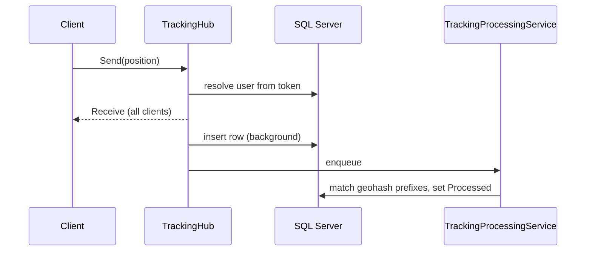

# ProjectIvy.Hub

ASP.NET Core SignalR host for live GPS tracking. Clients send positions to `/TrackingHub`. The hub stores each point in SQL Server, broadcasts it to every connected client, and a background service fills in city, country, and location from geohash prefix tables. `/JobHub` reprocesses a date range and reports progress back to the caller.

Built for .NET 10.



## Requirements

- [.NET 10 SDK](https://dotnet.microsoft.com/download)
- SQL Server with the tracking, user, and geohash tables the hubs query
- A Keycloak realm that issues JWTs for `TrackingHub.Send`
- A Graylog UDP endpoint. The process reads `GRAYLOG_HOST` and `GRAYLOG_PORT` while configuring Serilog and will not start without them.

## Run

Copy the sample environment and fill in real values. Do not commit secrets.

```bash
cp .env.example .env
```

```bash
dotnet build ProjectIvy.Hub.sln
dotnet run --project ProjectIvy.Hub
```

The demo client expects the host at `http://localhost:5000` unless you set `HUB_BASE_URL`.

### Environment

| Variable | Purpose |
| --- | --- |
| `CONNECTION_STRING_MAIN` | SQL Server connection used by both hubs and the processing service |
| `GRAYLOG_HOST` | Graylog hostname for the Serilog UDP sink |
| `GRAYLOG_PORT` | Graylog UDP port |
| `Keycloak__realm` | Keycloak realm |
| `Keycloak__auth-server-url` | Keycloak base URL |
| `Keycloak__resource` | Client id |
| `Keycloak__credentials__secret` | Client secret |
| `ASPNETCORE_ENVIRONMENT` | `Development` enables the developer exception page |

Keycloak can also live in the `Keycloak` section of `appsettings.json`. See [KEYCLOAK_AUTH_SETUP.md](KEYCLOAK_AUTH_SETUP.md) for cookie and bearer token order.

## Demo client

`ProjectIvy.Hub.Demo.Client` is an interactive console that connects to both hubs.

```bash
HUB_BASE_URL=http://localhost:5000 ACCESS_TOKEN=<jwt> dotnet run --project ProjectIvy.Hub.Demo.Client
```

| Menu | Hub method | Auth |
| --- | --- | --- |
| 1 | `JobHub.ProcessDay` | none |
| 2 | `TrackingHub.Send` | JWT required |
| 3 | Connect and listen | token optional |

`Send` prompts for latitude, longitude, speed, altitude, accuracy, timestamp, and user id. Defaults start near Zagreb and shift slightly after each send. `ProcessDay` prompts for an inclusive `from`, an exclusive `to`, and whether to reprocess rows that already have `Processed` set. Progress arrives as `ProcessDayProgress` (0–100) on that connection only.

## Hubs

Event names are `Receive` and `ProcessDayProgress`.

### `/TrackingHub`

| Method | Who receives it | What it does |
| --- | --- | --- |
| connect | caller | Sends the latest `Tracking.Tracking` row for `UserId = 1` as `Receive` |
| `Send(tracking)` | everyone | `[Authorize]`. Maps `preferred_username` to `[User].[User].Id` (cached for one hour), inserts the point, enqueues processing, then broadcasts `Receive` |

`Send` accepts:

| Field | Type | Notes |
| --- | --- | --- |
| `Latitude` | double | required |
| `Longitude` | double | required |
| `Timestamp` | datetime | stored as sent |
| `Speed` | double? | |
| `Altitude` | double? | |
| `Accuracy` | double? | |
| `UserId` | int | broadcast as sent; the inserted row uses the id resolved from the token |

The insert writes a precision-9 geohash. The stored user id comes from the token, so a missing or unknown `preferred_username` is saved as null.

Pass the JWT as an `AccessToken` cookie or `Authorization: Bearer`.

### `/JobHub`

`ProcessDay(from, to, reprocess)` is open. It counts rows in `[from, to)` and pages them (up to 10,000 at a time) onto the same processing queue.

- `reprocess = false` — only rows where `Processed` is null
- `reprocess = true` — every row in the range

Progress is an integer from 0 to 100, sent only to the caller. An empty range reports 100 immediately.

## Background processing

`TrackingProcessingService` loads `Tracking.LocationGeohash` at startup, drains the queue, then waits one second before the next pass. For each point it matches geohash prefixes of length 2–8 against `Common.CityGeohash` and `Common.CountryGeohash`. The longest matching prefix wins. Resolved city, country, and location ids are written back with `Processed` set to UTC now.

Tables touched: `Tracking.Tracking`, `Tracking.Location`, `Tracking.LocationGeohash`, `[User].[User]`, `Common.CityGeohash`, `Common.CountryGeohash`.

## Docker

The image is `mateanticevic/project-ivy-hub`, based on `mcr.microsoft.com/dotnet/aspnet:10.0`, and listens on port 80.

```bash
docker build -t mateanticevic/project-ivy-hub .
docker run --rm -p 8080:80 \
  -e CONNECTION_STRING_MAIN="Server=...;Database=...;User Id=...;Password=...;TrustServerCertificate=True;" \
  -e GRAYLOG_HOST=graylog \
  -e GRAYLOG_PORT=12201 \
  mateanticevic/project-ivy-hub
```

Jenkins builds that image and tags it with GitVersion. It pushes only when `CommitsSinceVersionSource` is 0.

## Layout

```
ProjectIvy.Hub/                  web host
  Hubs/                          TrackingHub, JobHub
  Services/                      background geohash resolution
  Models/  Constants/  Enrichers/
ProjectIvy.Hub.Demo.Client/      console client
Dockerfile  Jenkinsfile          image build and push
azure-pipelines.yml
KEYCLOAK_AUTH_SETUP.md           JWT cookie and bearer setup
```
